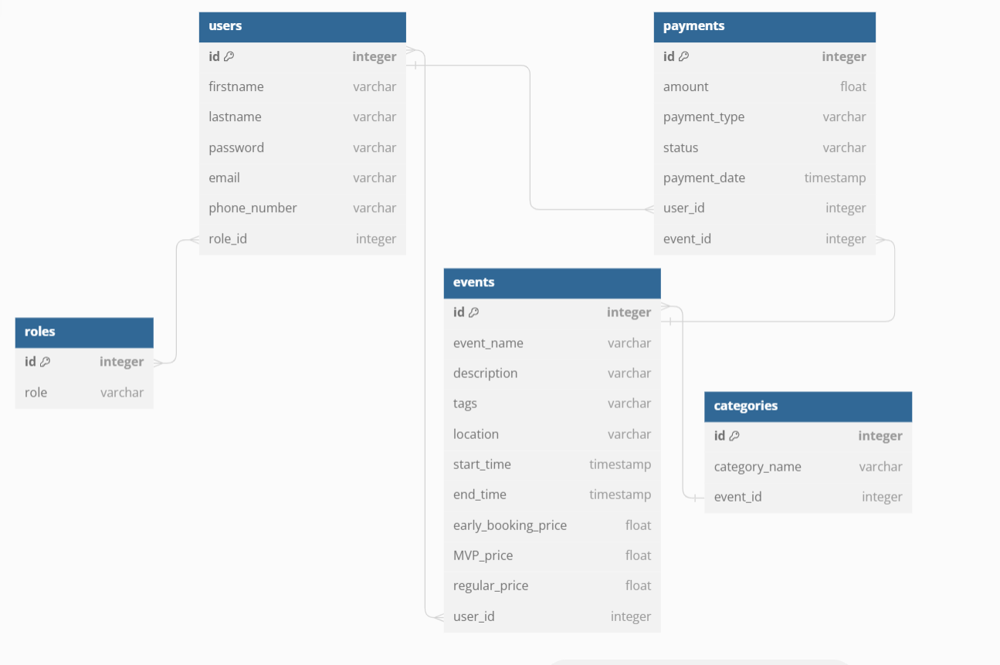

# Tiketi-Tamasha-backend

## Table of Contents
1. [Project Overview](#project-overview)
   1. [Problem Statement](#problem-statement)
   2. [Solution](#solution)
   3. [Team](#team)
2. [Architecture Overview](#architecture-overview)
   1. [Technology Stack](#technology-stack)
   2. [Development Setup](#development-setup)
   3. [System Components](#system-components)
3. [API Documentation](#api-documentation)
   1. [Authentication](#authentication)
   2. [User Management](#user-management)
   3. [Event Management](#event-management)
   4. [Ticket Management](#ticket-management)
   5. [Payment Processing](#payment-processing)
   6. [Search and Discovery](#search-and-discovery)
4. [Database Schema](#database-schema)
   1. [ERD Diagram](#erd-diagram)
   2. [Tables](#tables)
   3. [Relationships](#relationships)
5. [Security Measures](#security-measures)
   1. [JWT Bearer](#jwt-bearer)
   2. [User Roles and Permissions](#user-roles-and-permissions)
   3. [Secure Payment Processing](#secure-payment-processing)
6. [Testing Strategy](#testing-strategy)
   1. [Unittests](#minitests)
  
## 1. Project Overview<a name="project-overview"></a>

### 1.1 Problem Statement<a name="problem-statement"></a>
Existing event ticketing platforms often lack essential features, such as a simple user interface, secure payment processing, and real-time ticket availability updates. Tiketi Tamasha aims to overcome these challenges and provide a seamless experience.

### 1.2 Solution<a name="solution"></a>
The solution involves a Full Stack development approach with React for the frontend and Python Flask for the backend. The system emphasizes security through JWT Bearer authentication, user-defined roles, and secure payment processing with MPESA STK.

### 1.3 Team<a name="team"></a>
The project is developed by a Full Stack team with expertise in React for the frontend and Python Flask for the backend.
- [@WanjikuN](https://github.com/WanjikuN)
- [@VictorWanjala](https://github.com/VictorWanjala)
- [@obadia-maasai](https://github.com/obadia-maasai)
- [@MugereG](https://github.com/MugereG)
- [@Kevin42500](https://github.com/Kevin42500)

## 2. Architecture Overview<a name="architecture-overview"></a>

### 2.1 Technology Stack<a name="technology-stack"></a>
- Backend: Python Flask
- Database: PostgreSQL
- Frontend: ReactJs & Redux Toolkit (state management)
- Wireframes: Figma (Mobile-friendly)
- Testing Frameworks: Unittests

### 2.2 Development Setup<a name="development-setup"></a>
- Clone the repository:

   ```bash
   git clone git@github.com:WanjikuN/Tiketi-Tamasha-backend.git
    ```
- Navigate to the project directory:
    ```
    cd Tiketi-Tamasha-backend/

    ```
- Use the develop branch
    ```
    git checkout develop
    ```
- Install dependencies:
    ```
    npm install 
    ```
- Start the development server:
    ```
    npm start
    ```

### 2.3 System Components<a name="system-components"></a>
- Backend Server: Handles authentication, user and event management, ticketing, and payment processing.
- Database: Stores user data, event information, and transaction details.
- Frontend Client: Provides a user interface for interacting with the system.
- Testing Frameworks: Unittests for backend testing.

## 3. API Documentation<a name="api-documentation"></a>

### 3.1 Authentication<a name="authentication"></a>
- Endpoint: /login and /signup
- Description: Manages user authentication using JWT Bearer tokens.

### 3.2 User Management<a name="user-management"></a>
- Endpoint: /users and /roles
- Description: Allows user registration, role assignment, and profile management.

### 3.3 Event Management<a name="event-management"></a>
- Endpoint: /events and /categories
- Description: Enables organizers to create events, set ticket availability, and define pricing.

### 3.4 Ticket Management<a name="ticket-management"></a>
- Endpoint: /payments
- Description: Manages the purchase and viewing of tickets by customers.

### 3.5 Payment Processing<a name="payment-processing"></a>
- Endpoint: /lnmo
- Description: Facilitates secure payment processing using MPESA STK.

### 3.6 Search and Discovery<a name="search-and-discovery"></a>
- Endpoint: /search
- Description: Allows users to search for events based on location, tags, or categories.

## 4. Database Schema<a name="database-schema"></a>

### 4.1 ERD Diagram<a name="erd-diagram"></a>


### 4.2 Tables<a name="tables"></a>
- users
- roles
- events
- categories
- payments

### 4.3 Relationships<a name="relationships"></a>
- Ref: users.role_id <> roles.id // many-to-many
- Ref: events.user_id <> users.id // many-to-many
- Ref: payments.user_id > users.id // many-to-one
- Ref: payments.event_id > events.id // many-to-one
- Ref: events.category_id > categories.id // one-to-many
## 5. Security Measures<a name="security-measures"></a>

### 5.1 JWT Bearer<a name="jwt-bearer"></a>
- Ensures secure authentication using JWT Bearer tokens.

### 5.2 User Roles and Permissions<a name="user-roles-and-permissions"></a>
- Defines user roles with preset permissions to ensure proper access control.

### 5.3 Secure Payment Processing<a name="secure-payment-processing"></a>
- Implements secure payment processing through MPESA STK.

## 6. Testing Strategy<a name="testing-strategy"></a>

### 6.1 Unittests<a name="minitests"></a>
- Implements Minitests for backend testing to verify the correctness of server-side functionalities.

## License

This project is licensed under the [MIT License](./LICENSE.md).
